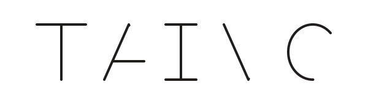

<!-- Hero wordmark — static on first paint, animates as progressive enhancement.
     Explicit height prevents layout shift before the SVG is parsed. -->

  

<h1 align="center">Frontend Engineer</h1>

  Frontend Engineer crafting <b>pixel-perfect</b>, accessible, and performant web experiences. 
  Passionate about <b>design systems</b>, component architecture, 
  and the intersection of design and engineering.

  
  

  
  
  
  

